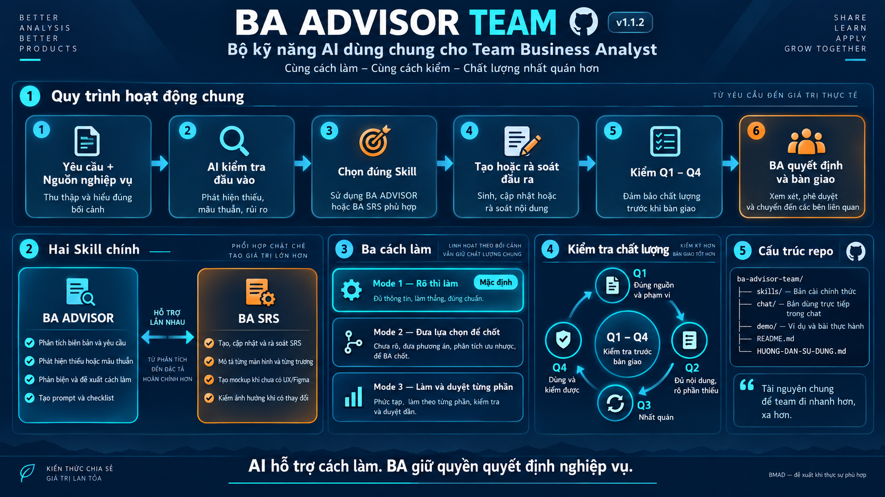

# BA Advisor Team

Bộ skill dùng chung cho team Business Analyst, giúp AI hỗ trợ theo cùng một cách: đọc đúng nguồn, làm rõ phần thiếu, phản biện khi cần, tạo tài liệu có cấu trúc và kiểm tra chất lượng trước khi bàn giao.

## Có gì trong bộ này?

- **`ba-advisor`** — điểm vào chung cho phân tích biên bản/yêu cầu, tách việc và quyết định, phát hiện thiếu hoặc mâu thuẫn, tư vấn cách làm, tạo prompt và checklist.
- **`ba-srs`** — chuyên viết, cập nhật và rà soát SRS theo bốn phần: Mô tả tóm tắt → Yêu cầu giao diện → Mô tả trường thông tin → Các tình huống sử dụng.
- **Ba mode làm việc** — mode 1 (rõ thì làm, mặc định), mode 2 (đưa lựa chọn để chốt trước), mode 3 (làm từng phần để BA góp ý).
- **Q1–Q4** — cách kiểm chung về đúng nguồn/phạm vi, đủ và rõ, nhất quán, dùng/kiểm được.

## Cài đặt nhanh

### Codex hoặc Antigravity

Chép nguyên hai thư mục `skills/ba-advisor` và `skills/ba-srs` vào thư mục `.agents/skills/` của dự án, rồi mở phiên mới.

### Claude Code

Chép hai thư mục trên vào `.claude/skills/`, rồi bắt đầu phiên mới.

### Chat không hỗ trợ nạp skill

Gửi tệp tương ứng trong `chat/` cùng nguồn nghiệp vụ:

- `BA-ADVISOR-CHAT.md` cho việc phân tích/tư vấn.
- `BA-SRS-CHAT.md` cho việc viết hoặc rà soát SRS.

Không gửi đồng thời bản gộp chat và các tệp chỉ dẫn gốc nếu công cụ đã nạp thư mục skill.

## Giao việc mẫu

```text
Dùng ba-advisor mode 1. Tôi cần [đầu ra].
Nguồn: [tệp hoặc nội dung].
Phạm vi: [phạm vi]. Không tự thêm phần chưa có căn cứ.
Kèm cách kiểm Q1–Q4; nếu là SRS/Delta đầy đủ thì trả một bảng kiểm.
```

Ví dụ SRS:

```text
Dùng ba-srs mode 3. Đặc tả màn hình [tên màn hình] từ [nguồn].
Chưa có UX/Figma thì dùng mockup Markdown có nhãn đề xuất.
Bắt đầu từ “Mô tả tóm tắt”, chờ tôi chốt từng phần.
```

## Nguyên tắc sử dụng

1. AI chỉ dùng thông tin có trong nguồn; điều chưa biết phải ghi rõ hoặc hỏi lại.
2. Nháp trong chat có thể ngắn để BA chốt nhanh; bản bàn giao vẫn phải đủ chi tiết theo mẫu.
3. `Đạt / Cần sửa / Chưa đủ căn cứ` là kết luận kiểm output, không phải phê duyệt nghiệp vụ.
4. BMAD chỉ được đề xuất khi workflow đó đem lại lợi ích rõ; không bắt mọi công việc phải chạy BMAD.
5. Khi một lỗi lặp lại, phân loại lỗi thuộc nguồn, workflow, mẫu hay cách kiểm rồi mới cập nhật skill và thêm ca thử.

## Tài liệu trong repo

- [Hướng dẫn sử dụng](HUONG-DAN-SU-DUNG.md)
- [Báo cáo audit và phát hành](AUDIT-VA-PHAT-HANH.md)
- [Demo offline](demo/XEM-DEMO.html)
- `chat/` — bản gộp để dùng ở nền tảng không nạp thư mục skill.
- `skills/` — bản cài chính thức.

## Phiên bản

Phiên bản hiện tại: **v1.1.2**. Bản v1.1.1 được giữ riêng tại máy phát hành để đối chiếu; khi nâng cấp, không cài song song hai phiên bản cùng tên trong một môi trường.

## Phạm vi kiểm chứng

Bản phát hành đã được kiểm tra cấu trúc, liên kết, bundle, ZIP và hai ca AI độc lập với nguồn giả lập. Hiệu quả giữa nhiều BA/model và trên mọi nền tảng vẫn cần được đánh giá qua công việc thật của team.
